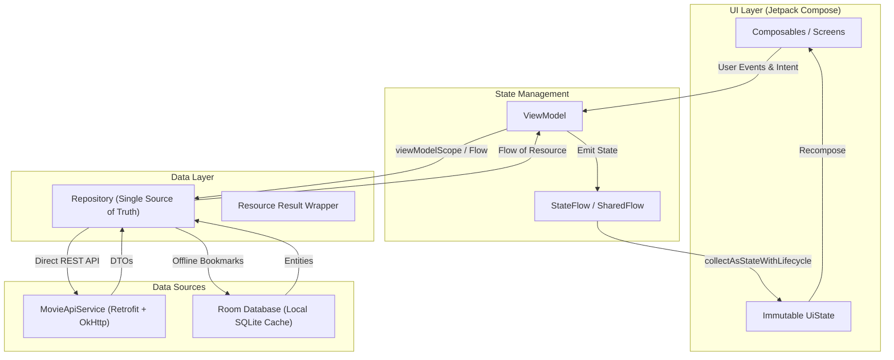

<div align="center">

  

# YoteShinZone (ရုပ်ရှင်ဇုန်)

### Android Movie & Series Hub Powered by Jetpack Compose & Spider-Man Neobrutalism

[-6366F1?style=for-the-badge>)](https://developer.android.com)
[-3DDC84?style=for-the-badge&logo=android&logoColor=white>)](https://developer.android.com)
[](https://kotlinlang.org)
[](https://developer.android.com/jetpack/compose)
[](DESIGN.md)
[-47A248?style=for-the-badge&logo=sqlite&logoColor=white>)](https://developer.android.com/training/data-storage/room)
[](https://developer.android.com/topic/architecture)
[](LICENSE)

  <p align="center">
    <a href="#key-features">Key Features</a> •
    <a href="#spider-man-neobrutalism-design-system">Design System</a> •
    <a href="#architecture--engineering">Architecture</a> •
    <a href="#project-structure">Project Structure</a> •
    <a href="#tech-stack">Tech Stack</a> •
    <a href="#getting-started">Getting Started</a> •
    <a href="#building--abi-splits">Build & Releases</a>
  </p>

</div>

---

## Overview

**YoteShinZone (ရုပ်ရှင်ဇုန်)** is a student hobby project developed as a final coursework submission for our university's **CS-706: Emerging Technology (Mobile Platforms)** course.

This project was built to explore and experiment with modern Android development—specifically building a complete UI using **Jetpack Compose** and **Material 3**, trying out a comic-inspired **Spider-Man Neobrutalism** design language, and organizing code using **MVVM with Unidirectional Data Flow (UDF)**.

### What the App Does:

- **Browse & Discover**: Fetches movie and TV show catalogs directly from a public REST API.
- **Search & Filters**: Debounced keyword search with quick resolution filter chips (All, 4K, 1080p, 720p).
- **Offline Bookmarks**: Saves favorite movies and shows locally in a SQLite database via Room.
- **Download & Stream Shortcuts**: Resolves direct video stream links with an in-app sniffer, with shortcuts to launch external downloaders (1DM / ADM) or Telegram.
- **Language & Theme Toggles**: One-tap switching between Myanmar Unicode and English, plus Classic Spidey (Light) and Symbiote (Dark) themes.

> **Note**: This is an academic hobby project created for learning and exploring mobile platform technologies, not a commercial streaming service.

---

## Spider-Man Neobrutalism Design System

YoteShinZone breaks away from generic flat interfaces through its custom **Spider-Man Neobrutalism Design System** (see [DESIGN.md](DESIGN.md)). The interface balances high-energy action with calm, structured utility.

### Dual Suit Themes

| Element             | Classic Suit (Light Mode) | Symbiote & Stealth Suit (Dark Mode) | Role & Semantics                                                                  |
| :------------------ | :------------------------ | :---------------------------------- | :-------------------------------------------------------------------------------- |
| **Spidey Red**      | `#E23636`                 | `#FF334B`                           | Primary brand accent: Top App Bar, primary CTAs, active indicators                |
| **Spidey Blue**     | `#0055FF`                 | `#2563EB`                           | Secondary brand accent: TV series & episode chips, download buttons, search focus |
| **Web Gold**        | `#FFC700`                 | `#FBBF24`                           | Rating stars, IMDb scores, highlighted badges                                     |
| **Canvas**          | `#F8F9FD` (Off-white)     | `#0A0E17` (Obsidian)                | Background canvas designed for zero eye-strain                                    |
| **Surface**         | `#FFFFFF` (Pure White)    | `#121826` (Elevated Navy)           | High-contrast card containers & sheets                                            |
| **Border & Shadow** | `#000000` (Solid 2.5dp)   | `#000000` (Solid 2.5dp)             | Signature hard borders & tactile drop shadows `(3dp, 3dp)`                        |

---

## Key Features

- **Infinite Movie & Series Feeds**
  - Instant discovery of trending movies and TV series with paginated infinite scrolling.
  - Smooth 60/120 FPS performance powered by custom `Modifier.drawBehind` and optimized Coil disk/memory caching (`ImageLoaderFactory`).
- **Instant Search & Dynamic Resolution Filters**
  - Real-time debounced query search for rapid title lookups.
  - Multi-resolution filtering chips (All, 4K, 1080p, 720p) to quickly locate preferred media quality.
- **TV Series & Episode Directory**
- Dedicated category switches with Spidey Blue episode badges for quick distinction between standalone movies and serials.
- **Smart Stream Sniffer & Download Manager**
  - Built-in `WebViewDownloadSniffer` that extracts direct stream URLs, bypassing timers and ad-redirects.
  - Instant integration with Android's native `DownloadManager`.
  - External downloader support with one-tap launches into **1DM** and **ADM**.
  - Direct protocol launch for **Telegram** streaming links.
  - One-tap clipboard copy for single or batch resolution links.
- **Offline Bookmarks (Room Database)**
  - Local persistence via SQLite / Room Database (`AppDatabase`, `MovieDao`).
  - Reactive updates using Kotlin Coroutines `Flow` and `StateFlow`.
- **One-Tap Theme & Language Toggles**
  - Instant switching between Classic Spidey Light Mode and Symbiote Dark Mode.
  - Effortless runtime language switching between Myanmar Unicode and English without restarting the activity.
- **Optimized ABI Splitting**
  - Built-in APK splitting for `arm64-v8a` and `armeabi-v7a` drastically reducing app size.
- **WCAG 2.2 AA Compliant Accessibility**
  - Minimum touch targets of 48dp × 48dp on all interactive elements.
  - Superior contrast ratios exceeding 14:1 for body copy and 4.6:1 for primary buttons.

---

## Architecture & Engineering

The application follows **Clean Architecture** principles and the official Android **Model-View-ViewModel (MVVM)** pattern with **Unidirectional Data Flow (UDF)**:



### Architectural Principles:

1. **Unidirectional Data Flow (UDF)**: ViewModels expose immutable `StateFlow<UiState>`. Composables are stateless, hoisting state and emitting user actions upward.
2. **Repository Pattern (SSOT)**: Repositories encapsulate all data operations, abstracting remote network calls and local Room database caching.
3. **Robust State Representation**: Network responses and database transactions are wrapped in a sealed `Resource<T>` class (`Loading`, `Success`, `Error`).
4. **Lifecycle-Aware Coroutines**: Asynchronous tasks are bounded to `viewModelScope`, ensuring automatic cancellation and zero memory leaks.

---

## Project Structure

Organized cleanly with an un-nested **Package-by-Feature** architecture:

```
MovieApp/
├── app/
│   ├── src/
│   │   ├── main/
│   │   │   ├── java/com/movieapp/
│   │   │   │   ├── data/local/              # Room Database persistence
│   │   │   │   │   ├── AppDatabase.kt       # Room Database definition
│   │   │   │   │   ├── MovieDao.kt          # DAO for bookmarked titles
│   │   │   │   │   ├── MovieEntity.kt       # Room entity for offline movies
│   │   │   │   │   ├── DownloadDao.kt       # DAO for offline download queue
│   │   │   │   │   └── DownloadEntity.kt    # Room entity for download records
│   │   │   │   ├── features/                # Package-by-Feature modules
│   │   │   │   │   ├── movielist/           # Catalog discovery (Movies & TV Shows)
│   │   │   │   │   ├── moviedetail/         # Synopsis, genres, cast & backdrop
│   │   │   │   │   ├── search/              # Real-time search with live debouncing
│   │   │   │   │   ├── bookmarks/           # Saved favorites & offline watchlists
│   │   │   │   │   ├── downloads/           # Download tracking & management screen
│   │   │   │   │   └── downloadlinks/       # Stream sniffer, resolvers & bottom sheet
│   │   │   │   ├── navigation/              # Jetpack Compose Navigation & routes
│   │   │   │   ├── network/                 # Retrofit, OkHttp, API definitions
│   │   │   │   ├── theme/                   # Spider-Man Neobrutalism design system
│   │   │   │   ├── util/                    # Resource wrappers, localization, constants
│   │   │   │   ├── MainActivity.kt          # Single Activity Compose host
│   │   │   │   └── MovieApplication.kt      # Application base & Coil image cache config
│   │   │   └── res/                         # Vector icons, drawables, fonts & mipmaps
│   │   └── test/                            # Robolectric JVM & Compose UI unit tests
│   ├── build.gradle.kts                     # App module configuration & ABI splits
│   └── proguard-rules.pro                   # R8 / ProGuard optimization rules
├── DESIGN.md                                # Spider-Man Neobrutalism design specs
├── build.gradle.kts                         # Root project build configuration
└── settings.gradle.kts                      # Gradle plugins & dependency repositories
```

---

## Tech Stack

| Category              | Technology / Library                                                                                              | Version          | Description                                         |
| :-------------------- | :---------------------------------------------------------------------------------------------------------------- | :--------------- | :-------------------------------------------------- |
| **Language**          | [Kotlin](https://kotlinlang.org)                                                                                  | `1.9.22`         | Modern, expressive, type-safe programming language  |
| **UI Framework**      | [Jetpack Compose](https://developer.android.com/jetpack/compose)                                                  | `BOM 2024.02.01` | Declarative UI toolkit for modern Android apps      |
| **Design System**     | [Material 3](https://m3.material.io)                                                                              | `1.2.0`          | Custom Spider-Man Neobrutalism theming & tokens     |
| **Navigation**        | [Navigation Compose](https://developer.android.com/jetpack/compose/navigation)                                    | `2.7.7`          | Type-safe single-activity navigation graph          |
| **Concurrency**       | [Kotlin Coroutines](https://github.com/Kotlin/kotlinx.coroutines)                                                 | `1.7.3`          | Asynchronous & non-blocking execution               |
| **Reactive Streams**  | [Kotlin Flow](https://kotlinlang.org/docs/flow.html)                                                              | `1.7.3`          | Cold streams & `StateFlow` reactive state holders   |
| **Networking**        | [Retrofit 2](https://square.github.io/retrofit/)                                                                  | `2.11.0`         | Type-safe HTTP REST client                          |
| **HTTP Engine**       | [OkHttp 3](https://square.github.io/okhttp/)                                                                      | `4.12.0`         | High-performance HTTP client & logging interceptor  |
| **Image Loading**     | [Coil Compose](https://coil-kt.github.io/coil/)                                                                   | `2.6.0`          | Lightweight, coroutine-powered image caching engine |
| **Local Persistence** | [Room](https://developer.android.com/training/data-storage/room)                                                  | `2.6.1`          | SQLite object mapping abstraction layer             |
| **Testing**           | [Robolectric](https://robolectric.org) & [Compose UI Test](https://developer.android.com/jetpack/compose/testing) | `4.11.1`         | Emulator-free JVM unit and Compose UI tests         |

---

## Getting Started

### Prerequisites

- **JDK 17**
- **Android Studio**
- **Android SDK Platform 34**

### 1. Clone the Repository

```bash
git clone https://github.com/phonewinttun-dev/Movie-App-Kotlin.git
cd Movie-App-Kotlin
```

### 2. Open in Android Studio

1. Open Android Studio and select **Open**.
2. Navigate to the cloned `Movie-App-Kotlin` folder.
3. Allow Gradle to sync dependencies and index the project.

> Note: This app uses external sources for movie data.

---

## Building & ABI Splits

### Building Debug APKs

The project uses **ABI Splitting** to build optimized, lightweight binaries tailored for ARM architectures:

```bash
# On Linux / macOS
./gradlew assembleDebug

# On Windows (PowerShell)
.\gradlew assembleDebug
```

Generated APKs will be located in:

```
app/build/outputs/apk/debug/
├── app-arm64-v8a-debug.apk     # 64-bit ARM devices (Recommended for modern phones)
└── app-armeabi-v7a-debug.apk   # 32-bit ARM legacy devices
```

### Running Unit & Compose Tests

Run the Robolectric JVM and Compose UI test suite locally without needing an active emulator:

```bash
./gradlew testDebugUnitTest
```

---

## Contributing

Contributions are what make the open-source community an incredible place to learn, inspire, and create! Any contributions you make are **greatly appreciated**.

1. **Fork** the Project
2. Create your Feature Branch (`git checkout -b feat/AmazingFeature`)
3. Commit your Changes (`git commit -m 'feat: add some AmazingFeature'`)
4. Push to the Branch (`git push origin feat/AmazingFeature`)
5. Open a **Pull Request**

---

<div align="center">

**Crafted with ❤️ by ArtificalPunks**

If you enjoyed this project, don't forget to give it a star on GitHub!

</div>
